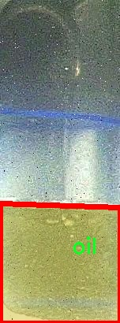

# 油位图像分割系统： yolov8-seg-C2f-DCNV2

### 1.研究背景与意义

[参考博客](https://gitee.com/YOLOv8_YOLOv11_Segmentation_Studio/projects)

[博客来源](https://kdocs.cn/l/cszuIiCKVNis)

研究背景与意义

随着工业化进程的加快，油品的使用和管理变得愈发重要。油位监测不仅是保障设备正常运行的必要手段，也是环境保护和资源管理的重要环节。传统的油位监测方法多依赖于人工观察和机械测量，这些方法不仅效率低下，而且容易受到人为因素的影响，导致数据的准确性和可靠性不足。近年来，计算机视觉技术的快速发展为油位监测提供了新的解决方案，尤其是基于深度学习的图像分割技术，展现出了优越的性能。

YOLO（You Only Look Once）系列模型因其高效的实时目标检测能力而广受欢迎。YOLOv8作为该系列的最新版本，进一步提升了模型的精度和速度，尤其在处理复杂场景和小目标检测方面表现出色。然而，针对油位图像的特定需求，YOLOv8仍存在一定的局限性，尤其是在油位图像的细粒度分割和背景干扰的处理上。因此，基于改进YOLOv8的油位图像分割系统的研究显得尤为重要。

本研究的核心在于构建一个高效的油位图像分割系统，旨在通过改进YOLOv8模型，提升其在油位图像分割任务中的表现。我们使用的油位数据集包含1200张图像，所有图像均属于单一类别“油”，这为模型的训练和评估提供了统一的标准。通过对该数据集的深入分析，我们可以识别出油位图像中的关键特征，并针对性地调整YOLOv8的网络结构和参数设置，以提高其对油位的识别和分割精度。

此外，油位图像分割系统的成功实施不仅能够提升油位监测的自动化水平，还能为工业界提供实时、准确的油位数据，降低人为错误的发生概率。通过自动化的油位监测系统，企业可以更有效地管理资源，减少浪费，提高生产效率。同时，该系统还能够为环境保护提供支持，及时发现油品泄漏等问题，降低对环境的影响。

综上所述，基于改进YOLOv8的油位图像分割系统的研究，不仅具有重要的理论意义，也具有广泛的应用前景。通过将深度学习技术与油位监测相结合，我们可以推动油品管理的智能化进程，为相关领域的研究提供新的思路和方法。未来的研究将进一步探索该系统在不同环境和条件下的适应性，推动其在实际应用中的落地和推广。

### 2.图片演示


注意：本项目提供完整的训练源码数据集和训练教程,由于此博客编辑较早,暂不提供权重文件（best.pt）,需要按照6.训练教程进行训练后实现上图效果。

### 3.视频演示

[3.1 视频演示](https://www.bilibili.com/video/BV1ne6AYUETu/)

### 4.数据集信息

##### 4.1 数据集类别数＆类别名

nc: 1
names: ['oil']


##### 4.2 数据集信息简介

数据集信息展示

在本研究中，我们使用了名为“oil-level”的数据集，以训练和改进YOLOv8-seg模型，旨在实现高效的油位图像分割系统。该数据集专注于油位检测，具有单一类别，类别数量为1，具体类别名称为“oil”。这一特定的设计使得数据集在油位监测和分析的应用场景中具有高度的针对性和实用性。

“oil-level”数据集的构建旨在提供丰富的图像样本，以便模型能够学习到油位的特征。数据集中包含了多种不同环境和条件下的油位图像，这些图像不仅涵盖了不同的油罐形状和尺寸，还考虑了光照变化、背景复杂度以及油的不同颜色和透明度等因素。这种多样性确保了模型在实际应用中能够具备良好的泛化能力，能够在各种实际场景中准确识别和分割油位。

在数据集的标注过程中，所有图像均经过精确的人工标注，确保每一幅图像中的油位区域都被准确地框定。这种高质量的标注对于训练深度学习模型至关重要，因为它直接影响到模型的学习效果和最终的分割精度。通过对油位区域的精确标注，YOLOv8-seg模型能够有效地学习到油位的边界特征，从而在测试阶段实现高效的分割。

此外，数据集的图像分辨率和质量也经过精心选择，以保证模型在训练过程中的视觉输入能够清晰且富有细节。这种高质量的输入数据不仅提高了模型的训练效率，还增强了模型对油位细微变化的敏感性，从而提高了分割的准确性。为了进一步提升模型的鲁棒性，数据集中还包含了一些经过数据增强处理的图像样本，例如随机旋转、缩放和颜色调整等。这些增强技术有助于扩展数据集的多样性，使得模型在面对不同类型的油位图像时，能够保持较高的识别和分割性能。

在进行模型训练时，我们将“oil-level”数据集划分为训练集和验证集，以便在训练过程中实时监控模型的性能并进行调优。通过这种方式，我们能够有效地评估模型在未见数据上的表现，确保其具备良好的泛化能力和实际应用价值。

总之，“oil-level”数据集为改进YOLOv8-seg的油位图像分割系统提供了坚实的基础。通过丰富的图像样本、精确的标注和有效的数据增强策略，该数据集不仅为模型的训练提供了必要的支持，也为后续的研究和应用奠定了良好的基础。随着油位监测技术的不断发展，我们相信该数据集将在相关领域中发挥重要作用，推动油位检测技术的进步与应用。




### 5.项目依赖环境部署教程（零基础手把手教学）

[5.1 环境部署教程链接（零基础手把手教学）](https://www.bilibili.com/video/BV1jG4Ve4E9t/?vd_source=bc9aec86d164b67a7004b996143742dc)


[5.2 安装Python虚拟环境创建和依赖库安装视频教程链接（零基础手把手教学）](https://www.bilibili.com/video/BV1nA4VeYEze/?vd_source=bc9aec86d164b67a7004b996143742dc)

### 6.手把手YOLOV8-seg训练视频教程（零基础手把手教学）

[6.1 手把手YOLOV8-seg训练视频教程（零基础小白有手就能学会）](https://www.bilibili.com/video/BV1cA4VeYETe/?vd_source=bc9aec86d164b67a7004b996143742dc)


按照上面的训练视频教程链接加载项目提供的数据集，运行train.py即可开始训练



     Epoch   gpu_mem       box       obj       cls    labels  img_size
     1/200     0G   0.01576   0.01955  0.007536        22      1280: 100%|██████████| 849/849 [14:42<00:00,  1.04s/it]
               Class     Images     Labels          P          R     mAP@.5 mAP@.5:.95: 100%|██████████| 213/213 [01:14<00:00,  2.87it/s]
                 all       3395      17314      0.994      0.957      0.0957      0.0843

     Epoch   gpu_mem       box       obj       cls    labels  img_size
     2/200     0G   0.01578   0.01923  0.007006        22      1280: 100%|██████████| 849/849 [14:44<00:00,  1.04s/it]
               Class     Images     Labels          P          R     mAP@.5 mAP@.5:.95: 100%|██████████| 213/213 [01:12<00:00,  2.95it/s]
                 all       3395      17314      0.996      0.956      0.0957      0.0845

     Epoch   gpu_mem       box       obj       cls    labels  img_size
     3/200     0G   0.01561    0.0191  0.006895        27      1280: 100%|██████████| 849/849 [10:56<00:00,  1.29it/s]
               Class     Images     Labels          P          R     mAP@.5 mAP@.5:.95: 100%|███████   | 187/213 [00:52<00:00,  4.04it/s]
                 all       3395      17314      0.996      0.957      0.0957      0.0845


### 7.50+种全套YOLOV8-seg创新点加载调参实验视频教程（一键加载写好的改进模型的配置文件）

[7.1 50+种全套YOLOV8-seg创新点加载调参实验视频教程（一键加载写好的改进模型的配置文件）](https://www.bilibili.com/video/BV1Hw4VePEXv/?vd_source=bc9aec86d164b67a7004b996143742dc)

### YOLOV8-seg算法简介

原始YOLOv8-seg算法原理

YOLOv8-seg算法是基于YOLOv8模型的一种扩展，旨在实现高效的目标检测与分割任务。该算法的提出是为了应对计算机视觉领域日益增长的需求，尤其是在实时目标检测和图像分割方面。YOLOv8-seg的设计理念是将目标检测与图像分割结合在一起，以便在处理复杂场景时，能够同时提供物体的位置信息和形状信息，从而提升模型的实用性和准确性。

YOLOv8模型的基础架构由Ultralytics团队在YOLOv5的基础上进行了多项改进，尤其是在主干网络、颈部网络和头部网络的设计上，融入了最新的技术和思想。YOLOv8-seg在此基础上进一步优化了分割功能，采用了更加精细的特征提取和处理机制，以便在目标检测的同时，能够对目标进行精确的像素级分割。

在YOLOv8-seg的主干网络中，C2f模块取代了传统的C3模块，C2f模块通过引入更多的跳层连接，显著增强了梯度流的信息传递。这种设计不仅提高了特征提取的效率，还确保了模型的轻量化，使得YOLOv8-seg在保持高精度的同时，具备了较快的推理速度。此外，SPPF模块的保留使得模型在处理多尺度特征时，能够有效地减少计算时间，提高整体性能。

颈部网络的设计同样至关重要，YOLOv8-seg采用了多尺度特征融合技术，将来自不同层次的特征图进行整合。这一过程确保了模型能够捕捉到不同尺度目标的信息，从而在复杂场景中实现更为精准的检测与分割。通过这种特征融合，YOLOv8-seg能够在面对各种目标大小和形状时，保持良好的检测性能。

在头部网络的设计上，YOLOv8-seg借鉴了YOLOX的解耦头思路，采用了两条并行的分支结构，分别负责目标的分类和定位任务。这种结构的引入使得模型在处理目标时，能够更加专注于不同任务的特征提取，从而提高了收敛速度和预测精度。同时，YOLOv8-seg采用了无锚框结构，直接预测目标的中心位置，结合任务对齐学习（Task Alignment Learning）机制，进一步提升了模型在复杂环境下的表现。

YOLOv8-seg在训练过程中，特别注意数据增强策略的选择。虽然Mosaic数据增强能够提升模型的鲁棒性，但其对数据真实分布的破坏也不容忽视。因此，YOLOv8-seg在训练的最后阶段停止使用Mosaic数据增强，以确保模型能够学习到更为真实的特征信息。这一策略的实施，有助于提高模型在实际应用中的泛化能力和准确性。

此外，YOLOv8-seg还在损失函数的设计上进行了创新，结合了分类损失和回归损失的计算，采用了加权策略，以确保模型在训练过程中能够平衡不同任务的需求。这种设计使得YOLOv8-seg在面对复杂场景时，能够有效降低误检和漏检的概率，从而提升整体的检测与分割性能。

在实际应用中，YOLOv8-seg展现出了优越的性能，尤其是在处理复杂背景和小目标时，其精确的像素级分割能力使得该算法在许多场景中都具有很高的实用价值。通过对YOLOv8-seg的不断优化和改进，研究人员能够在垃圾目标检测、自动驾驶、医疗影像分析等多个领域中，发挥其强大的潜力。

总的来说，YOLOv8-seg算法的设计理念和实现方式，充分体现了现代计算机视觉技术的发展趋势。通过将目标检测与图像分割相结合，YOLOv8-seg不仅提高了检测的准确性和速度，还为后续的研究和应用提供了广阔的空间。随着技术的不断进步，YOLOv8-seg有望在更多复杂场景中发挥重要作用，推动计算机视觉领域的进一步发展。


### 9.系统功能展示（检测对象为举例，实际内容以本项目数据集为准）

图9.1.系统支持检测结果表格显示

  图9.2.系统支持置信度和IOU阈值手动调节

  图9.3.系统支持自定义加载权重文件best.pt(需要你通过步骤5中训练获得)

  图9.4.系统支持摄像头实时识别

  图9.5.系统支持图片识别

  图9.6.系统支持视频识别

  图9.7.系统支持识别结果文件自动保存

  图9.8.系统支持Excel导出检测结果数据


### 10.50+种全套YOLOV8-seg创新点原理讲解（非科班也可以轻松写刊发刊，V11版本正在科研待更新）

#### 10.1 由于篇幅限制，每个创新点的具体原理讲解就不一一展开，具体见下列网址中的创新点对应子项目的技术原理博客网址【Blog】：


[10.1 50+种全套YOLOV8-seg创新点原理讲解链接](https://gitee.com/qunmasj/good)

#### 10.2 部分改进模块原理讲解(完整的改进原理见上图和技术博客链接)【如果此小节的图加载失败可以通过CSDN或者Github搜索该博客的标题访问原始博客，原始博客图片显示正常】
### YOLOv8简介
#### Backbone


借鉴了其他算法的这些设计思想

借鉴了VGG的思想，使用了较多的3×3卷积，在每一次池化操作后，将通道数翻倍；

借鉴了network in network的思想，使用全局平均池化（global average pooling）做预测，并把1×1的卷积核置于3×3的卷积核之间，用来压缩特征；（我没找到这一步体现在哪里）

使用了批归一化层稳定模型训练，加速收敛，并且起到正则化作用。

    以上三点为Darknet19借鉴其他模型的点。Darknet53当然是在继承了Darknet19的这些优点的基础上再新增了下面这些优点的。因此列在了这里

借鉴了ResNet的思想，在网络中大量使用了残差连接，因此网络结构可以设计的很深，并且缓解了训练中梯度消失的问题，使得模型更容易收敛。

使用步长为2的卷积层代替池化层实现降采样。（这一点在经典的Darknet-53上是很明显的，output的长和宽从256降到128，再降低到64，一路降低到8，应该是通过步长为2的卷积层实现的；在YOLOv8的卷积层中也有体现，比如图中我标出的这些位置）

#### 特征融合

模型架构图如下

  Darknet-53的特点可以这样概括：（Conv卷积模块+Residual Block残差块）串行叠加4次

  Conv卷积层+Residual Block残差网络就被称为一个stage


上面红色指出的那个，原始的Darknet-53里面有一层 卷积，在YOLOv8里面，把一层卷积移除了

为什么移除呢？

        原始Darknet-53模型中间加的这个卷积层做了什么？滤波器（卷积核）的个数从 上一个卷积层的512个，先增加到1024个卷积核，然后下一层卷积的卷积核的个数又降低到512个

        移除掉这一层以后，少了1024个卷积核，就可以少做1024次卷积运算，同时也少了1024个3×3的卷积核的参数，也就是少了9×1024个参数需要拟合。这样可以大大减少了模型的参数，（相当于做了轻量化吧）

        移除掉这个卷积层，可能是因为作者发现移除掉这个卷积层以后，模型的score有所提升，所以才移除掉的。为什么移除掉以后，分数有所提高呢？可能是因为多了这些参数就容易，参数过多导致模型在训练集删过拟合，但是在测试集上表现很差，最终模型的分数比较低。你移除掉这个卷积层以后，参数减少了，过拟合现象不那么严重了，泛化能力增强了。当然这个是，拿着你做实验的结论，反过来再找补，再去强行解释这种现象的合理性。

过拟合


通过MMdetection官方绘制册这个图我们可以看到，进来的这张图片经过一个“Feature Pyramid Network(简称FPN)”，然后最后的P3、P4、P5传递给下一层的Neck和Head去做识别任务。 PAN（Path Aggregation Network）


“FPN是自顶向下，将高层的强语义特征传递下来。PAN就是在FPN的后面添加一个自底向上的金字塔，对FPN补充，将低层的强定位特征传递上去，

FPN是自顶（小尺寸，卷积次数多得到的结果，语义信息丰富）向下（大尺寸，卷积次数少得到的结果），将高层的强语义特征传递下来，对整个金字塔进行增强，不过只增强了语义信息，对定位信息没有传递。PAN就是针对这一点，在FPN的后面添加一个自底（卷积次数少，大尺寸）向上（卷积次数多，小尺寸，语义信息丰富）的金字塔，对FPN补充，将低层的强定位特征传递上去，又被称之为“双塔战术”。

FPN层自顶向下传达强语义特征，而特征金字塔则自底向上传达强定位特征，两两联手，从不同的主干层对不同的检测层进行参数聚合,这样的操作确实很皮。
#### 自底向上增强

而 PAN（Path Aggregation Network）是对 FPN 的一种改进，它的设计理念是在 FPN 后面添加一个自底向上的金字塔。PAN 引入了路径聚合的方式，通过将浅层特征图（低分辨率但语义信息较弱）和深层特征图（高分辨率但语义信息丰富）进行聚合，并沿着特定的路径传递特征信息，将低层的强定位特征传递上去。这样的操作能够进一步增强多尺度特征的表达能力，使得 PAN 在目标检测任务中表现更加优秀。


### 可重参化EfficientRepBiPAN优化Neck
#### Repvgg-style
Repvgg-style的卷积层包含
卷积+ReLU结构，该结构能够有效地利用硬件资源。

在训练时，Repvgg-style的卷积层包含
卷积、
卷积、identity。（下图左图）


在推理时，通过重参数化（re-parameterization），上述的多分支结构可以转换为单分支的
卷积。（下图右图）


基于上述思想，作者设计了对GPU硬件友好的EfficientRep Backbone和Rep-PAN Neck，将它们用于YOLOv6中。

EfficientRep Backbone的结构图：


Rep-PAN Neck结构图：


#### Multi-path
只使用repvgg-style不能达到很好的精度-速度平衡，对于大模型，作者探索了多路径的网络结构。

参考该博客提出了Bep unit，其结构如下图所示：


CSP（Cross Stage Partial）-style计算量小，且有丰富的梯度融合信息，广泛应用于YOLO系列中，比如YOLOv5、PPYOLOE。

作者将Bep unit与CSP-style结合，设计了一种新的网络结构BepC3，如下图所示：


基于BepC3模块，作者设计了新的CSPBep Backbone和CSPRepPAN Neck，以达到很好的精度-速度平衡。

其他YOLO系列在使用CSP-stype结构时，partial ratio设置为1/2。为了达到更好的性能，在YOLOv6m中partial ratio的值为2/3，在YOLOv6l中partial ratio的值为1/2。

对于YOLOv6m，单纯使用Rep-style结构和使用BepC3结构的对比如下图所示：

#### BIFPN
BiFPN 全称 Bidirectional Feature Pyramid Network 加权双向（自顶向下 + 自低向上）特征金字塔网络。

相比较于PANet，BiFPN在设计上的改变：

总结下图：
图d 蓝色部分为自顶向下的通路，传递的是高层特征的语义信息；红色部分是自底向上的通路，传递的是低层特征的位置信息；紫色部分是上述第二点提到的同一层在输入节点和输入节点间新加的一条边。


我们删除那些只有一条输入边的节点。这么做的思路很简单：如果一个节点只有一条输入边而没有特征融合，那么它对旨在融合不同特征的特征网络的贡献就会很小。删除它对我们的网络影响不大，同时简化了双向网络；如上图d 的 P7右边第一个节点

如果原始输入节点和输出节点处于同一层，我们会在原始输入节点和输出节点之间添加一条额外的边。思路：以在不增加太多成本的情况下融合更多的特性；

与只有一个自顶向下和一个自底向上路径的PANet不同，我们处理每个双向路径(自顶向下和自底而上)路径作为一个特征网络层，并重复同一层多次，以实现更高层次的特征融合。如下图EfficientNet 的网络结构所示，我们对BiFPN是重复使用多次的。而这个使用次数也不是我们认为设定的，而是作为参数一起加入网络的设计当中，使用NAS技术算出来的。


Weighted Feature Fusion 带权特征融合：学习不同输入特征的重要性，对不同输入特征有区分的融合。
设计思路：传统的特征融合往往只是简单的 feature map 叠加/相加 (sum them up)，比如使用concat或者shortcut连接，而不对同时加进来的 feature map 进行区分。然而，不同的输入 feature map 具有不同的分辨率，它们对融合输入 feature map 的贡献也是不同的，因此简单的对他们进行相加或叠加处理并不是最佳的操作。所以这里我们提出了一种简单而高效的加权特融合的机制。
常见的带权特征融合有三种方法，分别是：


​
  这种方法比较简单，直接加一个可学习的权重。但是由于这个权重不受限制，所有可能引起训练的不稳定，所有并不推荐。
Softmax-based fusion: O = ∑ i e w i ∗ I i ϵ + ∑ j e w j O = \sum_{i} \frac{e^{w_i} * I_i}{ \epsilon+\sum_{j}e^{w_j}}O=∑ 

 

​
  使用这种方法可以将范围放缩到 [ 0 , 1 ] [0, 1][0,1] 之间，训练稳定，但是训练很慢，所有也不推荐。
Fast normalized fusion: O = ∑ i w i ∗ I i ϵ + ∑ j w j O = \sum_{i} \frac{w_i * I_i}{ \epsilon+\sum_{j}w_j}O=∑ 


### 11.项目核心源码讲解（再也不用担心看不懂代码逻辑）

#### 11.1 ultralytics\nn\__init__.py

以下是对代码的核心部分进行提炼和详细注释的结果：

```python
# Ultralytics YOLO 🚀, AGPL-3.0 license

# 从tasks模块中导入必要的类和函数
from .tasks import (
    BaseModel,              # 基础模型类，其他模型类的基类
    ClassificationModel,    # 分类模型类
    DetectionModel,         # 检测模型类
    SegmentationModel,      # 分割模型类
    attempt_load_one_weight, # 尝试加载单个权重文件的函数
    attempt_load_weights,   # 尝试加载多个权重文件的函数
    guess_model_scale,      # 猜测模型的缩放比例的函数
    guess_model_task,       # 猜测模型任务类型的函数
    parse_model,            # 解析模型结构的函数
    torch_safe_load,        # 安全加载PyTorch模型的函数
    yaml_model_load         # 从YAML文件加载模型的函数
)

# 定义模块的公开接口，指定可以被外部导入的类和函数
__all__ = (
    'attempt_load_one_weight',  # 单个权重加载函数
    'attempt_load_weights',      # 多个权重加载函数
    'parse_model',               # 模型解析函数
    'yaml_model_load',           # YAML加载函数
    'guess_model_task',          # 任务类型猜测函数
    'guess_model_scale',         # 模型缩放比例猜测函数
    'torch_safe_load',           # 安全加载函数
    'DetectionModel',            # 检测模型类
    'SegmentationModel',         # 分割模型类
    'ClassificationModel',       # 分类模型类
    'BaseModel'                  # 基础模型类
)
```

### 代码核心部分分析：
1. **导入模块**：代码从`tasks`模块中导入了多个类和函数，这些类和函数是YOLO模型实现的核心组件，包括模型的基础类和具体的模型类型（分类、检测、分割）以及与模型加载和解析相关的工具函数。

2. **公开接口**：通过`__all__`定义了模块的公开接口，确保在使用`from module import *`时，只导入这些指定的类和函数。这有助于控制模块的可见性和避免命名冲突。

### 注释目的：
- 注释详细解释了每个导入的内容及其用途，帮助理解代码的结构和功能。
- 通过明确的命名和注释，增强了代码的可读性和可维护性。

这个文件是Ultralytics YOLO项目中的一个初始化文件，通常用于定义模块的公共接口。在文件的开头，首先有一个注释，表明该项目是Ultralytics YOLO，并且遵循AGPL-3.0许可证。接下来，文件通过相对导入的方式引入了一些模型和函数，这些模型和函数主要用于处理不同的计算机视觉任务，如分类、检测和分割。

具体来说，导入的内容包括四种模型类：`BaseModel`、`ClassificationModel`、`DetectionModel`和`SegmentationModel`，这些类可能是用于构建和训练不同类型的神经网络模型。除此之外，还导入了一些辅助函数，如`attempt_load_one_weight`和`attempt_load_weights`，这些函数可能用于加载模型权重；`guess_model_scale`和`guess_model_task`用于推测模型的规模和任务类型；`parse_model`用于解析模型结构；`torch_safe_load`和`yaml_model_load`则可能用于安全地加载PyTorch模型和从YAML文件中加载模型配置。

在文件的最后，使用`__all__`定义了一个公共接口，列出了可以被外部模块导入的名称。这意味着，当其他模块使用`from ultralytics.nn import *`时，只会导入这些在`__all__`中列出的名称，而不会导入其他未列出的内容。这种做法有助于保持模块的整洁性和可读性，确保用户只接触到必要的功能。整体来看，这个文件为Ultralytics YOLO的核心功能提供了一个清晰的入口。

#### 11.2 ultralytics\hub\auth.py

以下是经过简化和注释的核心代码部分：

```python
import requests

# 定义API的根地址
HUB_API_ROOT = 'https://api.example.com'  # 这里替换为实际的API根地址
HUB_WEB_ROOT = 'https://web.example.com'  # 这里替换为实际的Web根地址
API_KEY_URL = f'{HUB_WEB_ROOT}/settings?tab=api+keys'  # API密钥设置的URL

class Auth:
    """
    处理身份验证过程，包括API密钥管理和基于cookie的身份验证。
    """
    id_token = api_key = False  # 初始化身份验证相关的属性

    def __init__(self, api_key='', verbose=False):
        """
        初始化Auth类，接受可选的API密钥。
        """
        # 处理输入的API密钥，保留API密钥部分
        api_key = api_key.split('_')[0]
        self.api_key = api_key or ''  # 如果没有提供API密钥，则使用空字符串

        # 如果提供了API密钥
        if self.api_key:
            # 尝试进行身份验证
            success = self.authenticate()
        else:
            # 如果没有提供API密钥，则请求用户输入
            success = self.request_api_key()

        # 如果身份验证成功，更新设置
        if success:
            print('身份验证成功 ✅')  # 打印成功信息
        else:
            print(f'请从 {API_KEY_URL} 获取API密钥')  # 提示用户获取API密钥

    def request_api_key(self, max_attempts=3):
        """
        提示用户输入API密钥，最多尝试指定次数。
        """
        import getpass
        for attempts in range(max_attempts):
            input_key = getpass.getpass(f'请输入API密钥: ')
            self.api_key = input_key.split('_')[0]  # 移除模型ID部分
            if self.authenticate():
                return True  # 身份验证成功
        raise ConnectionError('身份验证失败 ❌')  # 超过最大尝试次数，抛出异常

    def authenticate(self) -> bool:
        """
        尝试使用API密钥进行身份验证。
        """
        try:
            header = self.get_auth_header()  # 获取身份验证头
            if header:
                r = requests.post(f'{HUB_API_ROOT}/v1/auth', headers=header)  # 发送身份验证请求
                return r.json().get('success', False)  # 返回身份验证结果
            return False
        except Exception:
            return False  # 捕获异常并返回失败

    def get_auth_header(self):
        """
        获取用于API请求的身份验证头。
        """
        if self.api_key:
            return {'x-api-key': self.api_key}  # 返回API密钥头
        return None  # 如果没有API密钥，返回None
```

### 代码说明：
1. **导入模块**：导入`requests`模块用于发送HTTP请求。
2. **定义API根地址**：设置API和Web的根地址，方便后续请求。
3. **Auth类**：负责处理身份验证的逻辑。
   - **初始化**：接受API密钥并尝试进行身份验证。
   - **请求API密钥**：提示用户输入API密钥，最多尝试三次。
   - **身份验证**：使用API密钥向服务器发送请求以验证身份。
   - **获取身份验证头**：根据是否有API密钥返回相应的请求头。

### 主要功能：
- 该代码的核心功能是管理用户的身份验证过程，确保用户能够通过API密钥安全地访问服务。

这个程序文件是用于管理Ultralytics YOLO的身份验证过程，主要涉及API密钥的处理、基于cookie的身份验证以及请求头的生成。文件中定义了一个名为`Auth`的类，该类支持多种身份验证方式，包括直接使用API密钥、通过浏览器cookie进行身份验证（特别是在Google Colab环境中），以及提示用户输入API密钥。

在类的属性中，`id_token`、`api_key`和`model_key`都被初始化为`False`，用于存储身份验证所需的令牌和API密钥。构造函数`__init__`接受一个可选的API密钥参数，并根据提供的密钥或设置中的密钥进行初始化。如果提供的API密钥与设置中的密钥匹配，则记录用户已登录的状态；如果不匹配，则尝试进行身份验证。如果没有提供API密钥且当前环境为Google Colab，则尝试使用浏览器cookie进行身份验证；否则，提示用户输入API密钥。

`request_api_key`方法用于提示用户输入API密钥，最多允许三次尝试。如果用户输入的密钥有效，则返回成功；否则，抛出连接错误。`authenticate`方法尝试使用提供的API密钥或身份令牌与服务器进行身份验证，并返回是否成功的布尔值。如果身份验证失败，则重置无效的密钥并记录警告信息。

`auth_with_cookies`方法专门用于在Google Colab环境中通过cookie进行身份验证。如果成功获取到身份令牌，则调用`authenticate`方法进行进一步验证。最后，`get_auth_header`方法用于生成API请求所需的身份验证头，如果设置了身份令牌或API密钥，则返回相应的头信息。

整体来看，这个文件的主要功能是提供一种灵活的身份验证机制，以便用户能够安全地访问Ultralytics的API服务。

#### 11.3 ultralytics\trackers\utils\matching.py

以下是代码中最核心的部分，并附上详细的中文注释：

```python
import numpy as np
import scipy
from scipy.spatial.distance import cdist
from ultralytics.utils.metrics import bbox_ioa

try:
    import lap  # 导入线性分配库

    assert lap.__version__  # 验证包是否正确安装
except (ImportError, AssertionError, AttributeError):
    from ultralytics.utils.checks import check_requirements

    check_requirements('lapx>=0.5.2')  # 检查并安装所需的lap包
    import lap


def linear_assignment(cost_matrix, thresh, use_lap=True):
    """
    使用线性分配算法进行匹配。

    参数:
        cost_matrix (np.ndarray): 包含分配成本的矩阵。
        thresh (float): 认为分配有效的阈值。
        use_lap (bool, optional): 是否使用lap.lapjv进行计算。默认为True。

    返回:
        (tuple): 包含匹配索引、未匹配的索引（来自'a'）和未匹配的索引（来自'b'）的元组。
    """

    # 如果成本矩阵为空，返回空匹配和所有未匹配的索引
    if cost_matrix.size == 0:
        return np.empty((0, 2), dtype=int), tuple(range(cost_matrix.shape[0])), tuple(range(cost_matrix.shape[1]))

    if use_lap:
        # 使用lap库进行线性分配
        _, x, y = lap.lapjv(cost_matrix, extend_cost=True, cost_limit=thresh)
        matches = [[ix, mx] for ix, mx in enumerate(x) if mx >= 0]  # 找到匹配的索引
        unmatched_a = np.where(x < 0)[0]  # 找到未匹配的'a'索引
        unmatched_b = np.where(y < 0)[0]  # 找到未匹配的'b'索引
    else:
        # 使用scipy库进行线性分配
        x, y = scipy.optimize.linear_sum_assignment(cost_matrix)  # 行x，列y
        matches = np.asarray([[x[i], y[i]] for i in range(len(x)) if cost_matrix[x[i], y[i]] <= thresh])
        if len(matches) == 0:
            unmatched_a = list(np.arange(cost_matrix.shape[0]))  # 所有'a'索引未匹配
            unmatched_b = list(np.arange(cost_matrix.shape[1]))  # 所有'b'索引未匹配
        else:
            unmatched_a = list(set(np.arange(cost_matrix.shape[0])) - set(matches[:, 0]))  # 未匹配的'a'索引
            unmatched_b = list(set(np.arange(cost_matrix.shape[1])) - set(matches[:, 1]))  # 未匹配的'b'索引

    return matches, unmatched_a, unmatched_b  # 返回匹配结果和未匹配索引


def iou_distance(atracks, btracks):
    """
    基于交并比（IoU）计算轨迹之间的成本。

    参数:
        atracks (list[STrack] | list[np.ndarray]): 轨迹'a'或边界框的列表。
        btracks (list[STrack] | list[np.ndarray]): 轨迹'b'或边界框的列表。

    返回:
        (np.ndarray): 基于IoU计算的成本矩阵。
    """

    # 判断输入是否为边界框，若是则直接使用
    if (len(atracks) > 0 and isinstance(atracks[0], np.ndarray)) \
            or (len(btracks) > 0 and isinstance(btracks[0], np.ndarray)):
        atlbrs = atracks
        btlbrs = btracks
    else:
        atlbrs = [track.tlbr for track in atracks]  # 提取轨迹'a'的边界框
        btlbrs = [track.tlbr for track in btracks]  # 提取轨迹'b'的边界框

    ious = np.zeros((len(atlbrs), len(btlbrs)), dtype=np.float32)  # 初始化IoU矩阵
    if len(atlbrs) and len(btlbrs):
        # 计算IoU
        ious = bbox_ioa(np.ascontiguousarray(atlbrs, dtype=np.float32),
                        np.ascontiguousarray(btlbrs, dtype=np.float32),
                        iou=True)
    return 1 - ious  # 返回成本矩阵（1 - IoU）


def embedding_distance(tracks, detections, metric='cosine'):
    """
    基于嵌入计算轨迹和检测之间的距离。

    参数:
        tracks (list[STrack]): 轨迹列表。
        detections (list[BaseTrack]): 检测列表。
        metric (str, optional): 距离计算的度量方式。默认为'cosine'。

    返回:
        (np.ndarray): 基于嵌入计算的成本矩阵。
    """

    cost_matrix = np.zeros((len(tracks), len(detections)), dtype=np.float32)  # 初始化成本矩阵
    if cost_matrix.size == 0:
        return cost_matrix  # 如果成本矩阵为空，直接返回

    det_features = np.asarray([track.curr_feat for track in detections], dtype=np.float32)  # 提取检测特征
    track_features = np.asarray([track.smooth_feat for track in tracks], dtype=np.float32)  # 提取轨迹特征
    cost_matrix = np.maximum(0.0, cdist(track_features, det_features, metric))  # 计算距离并确保非负
    return cost_matrix  # 返回成本矩阵


def fuse_score(cost_matrix, detections):
    """
    将成本矩阵与检测分数融合，生成单一相似度矩阵。

    参数:
        cost_matrix (np.ndarray): 包含分配成本的矩阵。
        detections (list[BaseTrack]): 带有分数的检测列表。

    返回:
        (np.ndarray): 融合后的相似度矩阵。
    """

    if cost_matrix.size == 0:
        return cost_matrix  # 如果成本矩阵为空，直接返回

    iou_sim = 1 - cost_matrix  # 计算IoU相似度
    det_scores = np.array([det.score for det in detections])  # 提取检测分数
    det_scores = np.expand_dims(det_scores, axis=0).repeat(cost_matrix.shape[0], axis=0)  # 扩展分数维度以匹配成本矩阵
    fuse_sim = iou_sim * det_scores  # 融合相似度
    return 1 - fuse_sim  # 返回融合后的成本矩阵
```

以上代码实现了基于成本矩阵的线性分配、IoU距离计算、嵌入距离计算和相似度融合等功能，适用于目标跟踪等计算机视觉任务。

这个程序文件主要用于实现目标跟踪中的匹配算法，特别是基于成本矩阵的线性分配和相似度计算。它使用了 NumPy 和 SciPy 库来处理数组和计算距离，同时还引入了 LAP（线性分配问题的求解库）来优化匹配过程。

首先，文件导入了必要的库，包括 NumPy 和 SciPy 的空间距离计算模块。它还定义了一个函数 `linear_assignment`，用于根据给定的成本矩阵和阈值进行线性分配。该函数可以选择使用 LAP 库或 SciPy 的线性和分配算法来进行匹配。它返回匹配的索引以及未匹配的索引。

接下来，文件定义了 `iou_distance` 函数，该函数计算两个轨迹（或边界框）之间的交并比（IoU）作为成本矩阵。该函数会根据输入的轨迹类型（边界框或其他对象）来提取边界框的坐标，并计算它们之间的 IoU 值。返回的成本矩阵是通过将 IoU 值转换为成本（1 - IoU）得到的。

然后，文件定义了 `embedding_distance` 函数，用于计算轨迹和检测之间的距离，基于特征嵌入（embeddings）。该函数首先创建一个成本矩阵，然后通过计算轨迹和检测的特征之间的距离（使用余弦距离或其他指定的度量）来填充这个矩阵。

最后，文件定义了 `fuse_score` 函数，它将成本矩阵与检测得分融合，以生成一个单一的相似度矩阵。这个过程通过将 IoU 相似度与检测得分相乘来实现，最终返回的矩阵用于后续的匹配过程。

总体来说，这个文件提供了一系列函数，用于在目标跟踪任务中计算匹配成本，并通过不同的相似度度量来优化跟踪效果。

#### 11.4 utils.py

以下是代码中最核心的部分，并附上详细的中文注释：

```python
import os
import cv2
import pandas as pd
import streamlit as st
from PIL import Image
from QtFusion.path import abs_path

def save_uploaded_file(uploaded_file):
    """
    保存上传的文件到服务器上。

    Args:
        uploaded_file (UploadedFile): 通过Streamlit上传的文件。

    Returns:
        str: 保存文件的完整路径，如果没有文件上传则返回 None。
    """
    # 检查是否有文件上传
    if uploaded_file is not None:
        base_path = "tempDir"  # 定义文件保存的基本路径

        # 如果路径不存在，创建这个路径
        if not os.path.exists(base_path):
            os.makedirs(base_path)
        
        # 获取文件的完整路径
        file_path = os.path.join(base_path, uploaded_file.name)

        # 以二进制写模式打开文件
        with open(file_path, "wb") as f:
            f.write(uploaded_file.getbuffer())  # 将上传的文件内容写入到指定路径

        return file_path  # 返回文件路径

    return None  # 如果没有文件上传，返回 None


def concat_results(result, location, confidence, time):
    """
    显示检测结果。

    Args:
        result (str): 检测结果。
        location (str): 检测位置。
        confidence (str): 置信度。
        time (str): 检测用时。

    Returns:
        DataFrame: 包含检测结果的 DataFrame。
    """
    # 创建一个包含这些信息的字典
    result_data = {
        "识别结果": [result],
        "位置": [location],
        "置信度": [confidence],
        "用时": [time]
    }

    # 将字典转换为 DataFrame
    results_df = pd.DataFrame(result_data)
    return results_df


def get_camera_names():
    """
    获取可用摄像头名称列表。

    Returns:
        list: 返回包含“未启用摄像头”和可用摄像头索引号的列表。
    """
    camera_names = ["摄像头检测关闭", "0"]  # 初始化摄像头名称列表
    max_test_cameras = 10  # 定义要测试的最大摄像头数量

    # 循环测试每个摄像头
    for i in range(max_test_cameras):
        cap = cv2.VideoCapture(i, cv2.CAP_DSHOW)  # 尝试打开摄像头
        if cap.isOpened() and str(i) not in camera_names:  # 如果摄像头成功打开且不在列表中
            camera_names.append(str(i))  # 添加摄像头索引到列表
            cap.release()  # 释放摄像头资源
    
    # 如果没有找到可用的摄像头，提示用户
    if len(camera_names) == 1:
        st.write("未找到可用的摄像头")
    
    return camera_names  # 返回可用摄像头名称列表
```

### 代码说明：
1. **保存上传文件**：`save_uploaded_file` 函数用于将用户通过 Streamlit 上传的文件保存到服务器的指定目录中。如果没有文件上传，则返回 `None`。
2. **显示检测结果**：`concat_results` 函数创建一个包含检测结果、位置、置信度和用时的信息的 DataFrame，便于后续处理和展示。
3. **获取摄像头名称**：`get_camera_names` 函数尝试打开多个摄像头并返回可用的摄像头索引。如果没有找到可用的摄像头，则会给出提示。

这个程序文件 `utils.py` 主要包含了一些实用的函数，用于处理文件上传、显示检测结果、加载默认图片以及获取可用摄像头的名称。首先，文件导入了一些必要的库，包括 `os`、`cv2`、`pandas`、`streamlit`、`PIL` 和 `QtFusion.path`。

在 `save_uploaded_file` 函数中，首先检查是否有文件被上传。如果有，定义一个基本路径 `tempDir` 用于保存文件。如果该路径不存在，则创建它。接着，获取上传文件的完整路径，并以二进制写模式打开文件，将上传的内容写入到指定路径中。最后，返回保存文件的完整路径；如果没有文件上传，则返回 `None`。

`concat_results` 函数用于显示检测结果。它接收检测结果、位置、置信度和用时作为参数，并将这些信息组织成一个 Pandas DataFrame，以便后续处理或展示。

`load_default_image` 函数用于加载默认图片。它通过调用 `abs_path` 函数获取默认图片的绝对路径，并使用 `PIL` 库打开该图片，返回一个图片对象。

最后，`get_camera_names` 函数用于获取可用摄像头的名称列表。它首先初始化一个包含“未启用摄像头”和索引“0”的列表，然后循环测试最多10个摄像头。如果成功打开某个摄像头，则将其索引添加到列表中。若没有找到可用的摄像头，则在 Streamlit 界面上输出相应提示。最终返回可用摄像头的名称列表。

整体来看，这个文件提供了一些基础的功能，便于在 Streamlit 应用中处理文件上传、展示结果、加载图片和获取摄像头信息。

#### 11.5 ultralytics\models\fastsam\__init__.py

以下是保留的核心代码部分，并附上详细的中文注释：

```python
# 导入所需的模块和类
from .model import FastSAM  # 导入FastSAM模型类
from .predict import FastSAMPredictor  # 导入FastSAMPredictor类，用于进行预测
from .prompt import FastSAMPrompt  # 导入FastSAMPrompt类，用于处理提示信息
from .val import FastSAMValidator  # 导入FastSAMValidator类，用于验证模型性能

# 定义模块的公开接口，用户可以通过这个接口访问这些类
__all__ = 'FastSAMPredictor', 'FastSAM', 'FastSAMPrompt', 'FastSAMValidator'
```

### 注释说明：
1. **模块导入**：代码的前四行导入了不同的类，这些类分别用于模型的定义、预测、提示处理和验证。通过这种方式，可以将不同功能模块化，便于管理和使用。
   
2. **`__all__`**：这一行定义了模块的公开接口，表示当使用 `from module import *` 时，只有列在 `__all__` 中的类会被导入。这有助于控制模块的可见性，避免不必要的内部实现细节暴露给用户。

这个程序文件是一个Python模块的初始化文件，位于`ultralytics/models/fastsam`目录下。它的主要功能是导入该模块中定义的类和函数，并将它们公开，以便其他模块可以使用。

首先，文件开头有一行注释，提到这是Ultralytics YOLO项目的一部分，并声明了其使用的AGPL-3.0许可证。这表明该项目是开源的，用户可以自由使用和修改，但需要遵循相应的许可证条款。

接下来，文件通过相对导入的方式引入了四个重要的组件：`FastSAM`、`FastSAMPredictor`、`FastSAMPrompt`和`FastSAMValidator`。这些组件分别来自于同一目录下的不同模块文件。具体来说：

- `FastSAM`可能是一个模型类，负责定义和实现FastSAM算法的核心功能。
- `FastSAMPredictor`是一个预测器类，可能用于执行模型的推理操作，即根据输入数据生成预测结果。
- `FastSAMPrompt`可能涉及到与用户交互的功能，提供某种形式的提示或输入处理。
- `FastSAMValidator`则可能用于验证模型的性能，评估其在特定数据集上的表现。

最后，`__all__`变量定义了该模块的公共接口，列出了可以被外部导入的名称。这意味着，当其他模块使用`from ultralytics.models.fastsam import *`语句时，只会导入`FastSAMPredictor`、`FastSAM`、`FastSAMPrompt`和`FastSAMValidator`这四个组件，而不会导入模块中的其他内容。这种做法有助于控制模块的可见性和避免命名冲突。

总的来说，这个初始化文件的主要作用是组织和管理FastSAM模块中的各个组件，使得它们可以被方便地导入和使用。

### 12.系统整体结构（节选）

### 程序整体功能和构架概括

该程序是Ultralytics YOLO项目的一部分，主要用于计算机视觉任务，包括目标检测、跟踪和图像处理。项目的架构分为多个模块，每个模块负责特定的功能。整体上，程序通过定义和组织不同的类和函数，提供了一个灵活的框架，支持模型的训练、推理、身份验证、结果展示和其他实用功能。

- **核心模块**：`ultralytics.nn`提供了模型的定义和接口，支持不同类型的计算机视觉任务。
- **身份验证模块**：`ultralytics.hub.auth`处理API的身份验证，确保用户能够安全地访问Ultralytics的服务。
- **跟踪模块**：`ultralytics.trackers.utils.matching`实现了目标跟踪中的匹配算法，优化了目标跟踪的效果。
- **实用工具模块**：`utils.py`提供了一些通用的实用函数，支持文件上传、结果展示和摄像头信息获取。
- **FastSAM模块**：`ultralytics.models.fastsam`提供了FastSAM算法的实现，支持快速的目标检测和分割。

### 文件功能整理表

| 文件路径                                   | 功能描述                                                                                   |
|--------------------------------------------|--------------------------------------------------------------------------------------------|
| `ultralytics/nn/__init__.py`              | 定义模型的公共接口，导入核心模型类和辅助函数，支持分类、检测和分割任务。                   |
| `ultralytics/hub/auth.py`                 | 处理API身份验证，包括API密钥和cookie的管理，确保用户安全访问Ultralytics服务。              |
| `ultralytics/trackers/utils/matching.py`  | 实现目标跟踪中的匹配算法，计算成本矩阵和相似度，优化目标跟踪效果。                       |
| `utils.py`                                 | 提供通用的实用函数，支持文件上传、结果展示、加载默认图片和获取可用摄像头信息。           |
| `ultralytics/models/fastsam/__init__.py`  | 导入和组织FastSAM算法相关的类和函数，提供快速目标检测和分割的功能。                       |

通过这种模块化的设计，程序能够高效地处理不同的计算机视觉任务，同时保持代码的可读性和可维护性。

### 13.图片、视频、摄像头图像分割Demo(去除WebUI)代码

在这个博客小节中，我们将讨论如何在不使用WebUI的情况下，实现图像分割模型的使用。本项目代码已经优化整合，方便用户将分割功能嵌入自己的项目中。
核心功能包括图片、视频、摄像头图像的分割，ROI区域的轮廓提取、类别分类、周长计算、面积计算、圆度计算以及颜色提取等。
这些功能提供了良好的二次开发基础。

### 核心代码解读

以下是主要代码片段，我们会为每一块代码进行详细的批注解释：

```python
import random
import cv2
import numpy as np
from PIL import ImageFont, ImageDraw, Image
from hashlib import md5
from model import Web_Detector
from chinese_name_list import Label_list

# 根据名称生成颜色
def generate_color_based_on_name(name):
    ......

# 计算多边形面积
def calculate_polygon_area(points):
    return cv2.contourArea(points.astype(np.float32))

...
# 绘制中文标签
def draw_with_chinese(image, text, position, font_size=20, color=(255, 0, 0)):
    image_pil = Image.fromarray(cv2.cvtColor(image, cv2.COLOR_BGR2RGB))
    draw = ImageDraw.Draw(image_pil)
    font = ImageFont.truetype("simsun.ttc", font_size, encoding="unic")
    draw.text(position, text, font=font, fill=color)
    return cv2.cvtColor(np.array(image_pil), cv2.COLOR_RGB2BGR)

# 动态调整参数
def adjust_parameter(image_size, base_size=1000):
    max_size = max(image_size)
    return max_size / base_size

# 绘制检测结果
def draw_detections(image, info, alpha=0.2):
    name, bbox, conf, cls_id, mask = info['class_name'], info['bbox'], info['score'], info['class_id'], info['mask']
    adjust_param = adjust_parameter(image.shape[:2])
    spacing = int(20 * adjust_param)

    if mask is None:
        x1, y1, x2, y2 = bbox
        aim_frame_area = (x2 - x1) * (y2 - y1)
        cv2.rectangle(image, (x1, y1), (x2, y2), color=(0, 0, 255), thickness=int(3 * adjust_param))
        image = draw_with_chinese(image, name, (x1, y1 - int(30 * adjust_param)), font_size=int(35 * adjust_param))
        y_offset = int(50 * adjust_param)  # 类别名称上方绘制，其下方留出空间
    else:
        mask_points = np.concatenate(mask)
        aim_frame_area = calculate_polygon_area(mask_points)
        mask_color = generate_color_based_on_name(name)
        try:
            overlay = image.copy()
            cv2.fillPoly(overlay, [mask_points.astype(np.int32)], mask_color)
            image = cv2.addWeighted(overlay, 0.3, image, 0.7, 0)
            cv2.drawContours(image, [mask_points.astype(np.int32)], -1, (0, 0, 255), thickness=int(8 * adjust_param))

            # 计算面积、周长、圆度
            area = cv2.contourArea(mask_points.astype(np.int32))
            perimeter = cv2.arcLength(mask_points.astype(np.int32), True)
            ......

            # 计算色彩
            mask = np.zeros(image.shape[:2], dtype=np.uint8)
            cv2.drawContours(mask, [mask_points.astype(np.int32)], -1, 255, -1)
            color_points = cv2.findNonZero(mask)
            ......

            # 绘制类别名称
            x, y = np.min(mask_points, axis=0).astype(int)
            image = draw_with_chinese(image, name, (x, y - int(30 * adjust_param)), font_size=int(35 * adjust_param))
            y_offset = int(50 * adjust_param)

            # 绘制面积、周长、圆度和色彩值
            metrics = [("Area", area), ("Perimeter", perimeter), ("Circularity", circularity), ("Color", color_str)]
            for idx, (metric_name, metric_value) in enumerate(metrics):
                ......

    return image, aim_frame_area

# 处理每帧图像
def process_frame(model, image):
    pre_img = model.preprocess(image)
    pred = model.predict(pre_img)
    det = pred[0] if det is not None and len(det)
    if det:
        det_info = model.postprocess(pred)
        for info in det_info:
            image, _ = draw_detections(image, info)
    return image

if __name__ == "__main__":
    cls_name = Label_list
    model = Web_Detector()
    model.load_model("./weights/yolov8s-seg.pt")

    # 摄像头实时处理
    cap = cv2.VideoCapture(0)
    while cap.isOpened():
        ret, frame = cap.read()
        if not ret:
            break
        ......

    # 图片处理
    image_path = './icon/OIP.jpg'
    image = cv2.imread(image_path)
    if image is not None:
        processed_image = process_frame(model, image)
        ......

    # 视频处理
    video_path = ''  # 输入视频的路径
    cap = cv2.VideoCapture(video_path)
    while cap.isOpened():
        ret, frame = cap.read()
        ......
```


### 14.完整训练+Web前端界面+50+种创新点源码、数据集获取


# [下载链接：https://mbd.pub/o/bread/Z5yVmJ1t](https://mbd.pub/o/bread/Z5yVmJ1t)